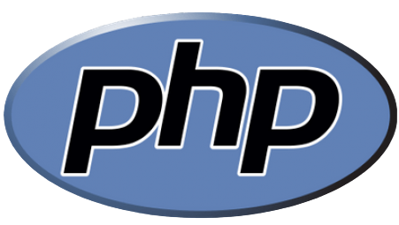
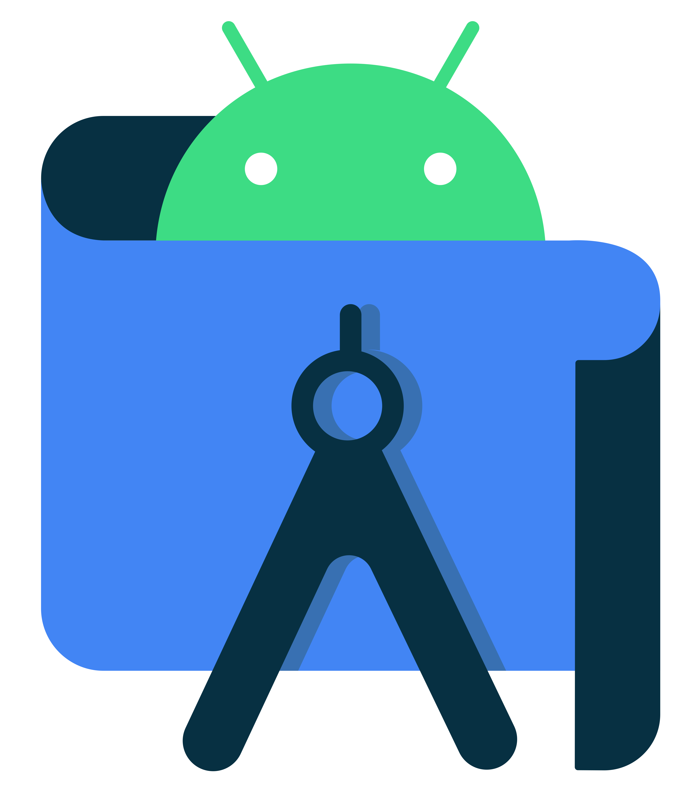

# Hi, I'm Ewald 👋 

## I'm a Software developer!!

- 🌱 I’m currently learning everything 🤣
- 👯 I’m looking to collaborate with other developers
- 🥅 Goals: Learn more about Machine learning
- 😍 I also love Grahics designing & Video editing
- 📧 You can reach me via my email ewalda905@gmail.com

### Connect with me:

&nbsp;&nbsp;

&nbsp;&nbsp;

&nbsp;&nbsp;

&nbsp;&nbsp;

### Languages, Frameworks and Tools:

 
 

---

### 💼 Latest Projects

<!-- YOUTUBE:START -->
<!--- [SYDF!](https://www.youtube.com)-->

---

### 📕 Latest Blog Posts

<!-- BLOG-POST-LIST:START -->
<!--  - [Render ATL 2023 Trip Report](https://dev.to/codestackr/render-atl-2023-trip-report-mp4) -->

---

  
:zap: GitHub Stats

  

